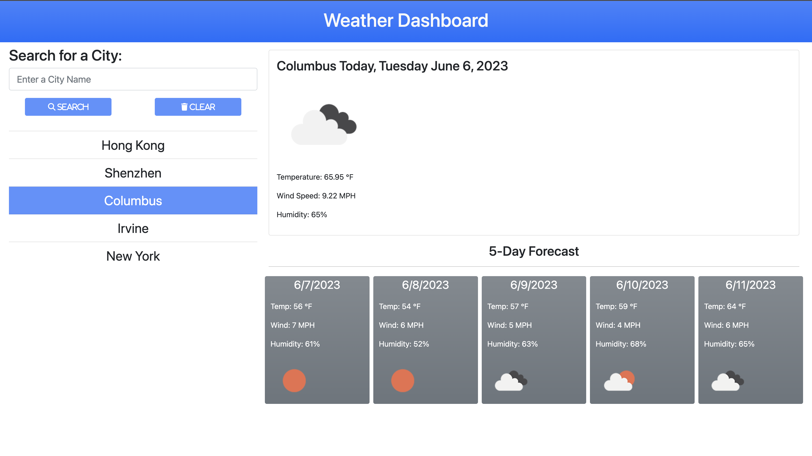

# Weather-Dashboard
This is a simple weather app that shows the chosen city's current weather and its 5-day forecast.

This site uses:

- [OpenWeatherAPI](https://openweathermap.org/api) to fetch weather data
- [jQuery](https://jquery.com/) for shortening my codes
- [Bootstrap](https://getbootstrap.com/docs/5.1/getting-started/introduction/) for CSS styling
- [FontAwesome](https://fontawesome.com/docs) for styling icons
- [GooglePlaceAPI](https://developers.google.com/maps/documentation/places/web-service/autocomplete) for Place Autocomplete
- [GoogleFonts](https://fonts.google.com/) for Fonts

## Description
```md
AS A traveler
I WANT to see the weather outlook for multiple cities
SO THAT I can plan a trip accordingly
```

```md
GIVEN a weather dashboard with form inputs
WHEN I search for a valid city by clicking the search button or pressing enter
THEN I am presented with current and future conditions for that city and that city is added to the search history
WHEN I type the city name in disreglard of case sensitivity
THEN I am always corrected with first letter of each word capitalized
WHEN I search the same city by accident
THEN I will NOT be adding it again to the search history
WHEN I start to type anything in the search box
THEN I am presented with a drop down menu to help me get a more precise location
WHEN I click the suggestion in the drop down menu without pressing the search button
THEN I am also presented with the current weather and forecasts
WHEN I search for more than 5 different cities
THEN I replace the last city searched with the newest city input
WHEN I view current weather conditions for that city
THEN I am presented with the city name, the date, an icon representation of weather conditions, the temperature, the humidity, and the the wind speed
WHEN I view future weather conditions for that city
THEN I am presented with a 5-day forecast that displays the date, an icon representation of weather conditions, the temperature, the wind speed, and the humidity
WHEN I hover over a city in the search history
THEN I am presented with the city name highlighted
WHEN I click on a city in the search history
THEN I am again presented with current and future conditions for that city
WHEN I click on the Clear Button
THEN I am presented with an empty search history list.
```

## Links
Deployed Wesite: https://ronin1702.github.io/Weather-Dashboard/

GitHub Repo: https://github.com/Ronin1702/Weather-Dashboard/

### Screenshot

